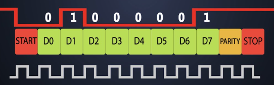

# UART TX Communication Protocol with FPGA (TANG NANO 9K) – VHDL

This repository contains a **UART (Universal Asynchronous Receiver/Transmitter)** transmitter project implemented in **VHDL** on the **TANG NANO 9K** FPGA. The project covers essential components and functionalities such as sending data triggered by a button input, debouncing the button signal, and serial data transmission via the UART protocol.

## Table of Contents

1. [Project Purpose](#project-purpose)  
2. [Overview](#overview)  
3. [File Descriptions](#file-descriptions)  
4. [Block Diagram (Summary)](#block-diagram-summary)  
5. [Development Environment](#development-environment)  
6. [Setup and Running](#setup-and-running)  
7. [Contributors and License](#contributors-and-license)  

---

## Project Purpose

The goals of this project are to:

- Demonstrate how to design a **UART TX** transmitter module on an FPGA,  
- Showcase the use of button debouncing (to clean up noisy signals that occur when a button is pressed),  
- Enable serial data transmission from the FPGA based on a simple counter or user interaction.

Serial communication is frequently used in embedded systems for sending sensor data or control commands. This project illustrates the fundamentals of implementing a UART protocol in FPGA using VHDL.

---

## Overview

- UART parameters such as **baud rate** can be configured in `UART_TRANSMITTER.vhd` or in the top-level module.  
- A button press triggers the FPGA to send a specific data value or the counter value via the UART interface.  
- **Debounce** logic ensures that noisy button signals are filtered, so a single button press results in the correct data being sent.

---

## File Descriptions

### 1. `DEBOUNCE_BUTTON.vhd`
- Filters and cleans up the input signal from a physical button.
- Generates a single clean (debounced) pulse corresponding to each button press.
- Utilizes a time-based counter or FSM (Finite State Machine) approach to convert the bouncing signal into a stable output.

### 2. `UART_TRANSMITTER.vhd`
- Transmits data bits serially to the outside world, following the UART protocol.
- Generates the frame consisting of **Start** bit, data bits, and **Stop** bit.
- Uses an internal baud rate generator or an external clock signal (possibly provided by the top-level module) to regulate the data rate.

### 3. `TOP_UART_TX_COUNTER.vhd`
- Serves as the top-level module of the project.
- Instantiates both `DEBOUNCE_BUTTON` and `UART_TRANSMITTER` modules.
- May include a counter (or an additional FSM) to determine which data is sent under which condition.
- Handles pin assignments (such as the clock signal and I/O pins) for the Tang Nano 9K FPGA (specific to your design constraints).

---

## Block Diagram (Summary)

A simplified diagram of the system is shown below:

      +---------------------+
      |   DEBOUNCE_BUTTON   |
      |    (Button Input)   |
      +----------+----------+
                 |
                 v
      +---------------------+
      | TOP_UART_TX_COUNTER|
      |    (Control/Logic) |
      +----------+----------+
                 |
                 v
      +---------------------+
      |  UART_TRANSMITTER  |
      | (Serial Data Out)  |
      +----------+----------+
                 |
              UART_TX

---

## Development Environment

- **Vivado**: Used for VHDL coding, synthesis, and implementation.  
  > NOTE: The Tang Nano 9K is typically from the GOWIN FPGA family. While the example code here is written for Vivado, you may need to use the **GOWIN IDE** or **GOWIN EDA** tools to build and upload the design to the actual Tang Nano 9K hardware. This README focuses on the general VHDL design approach.

- **Language**: VHDL

---

## Setup and Running

1. **Download Project Files**  
   - Clone this repository or download as a ZIP and extract it locally.

2. **Create a Vivado Project**  
   - In Vivado, create a new project. (For real hardware testing on Tang Nano 9K, you should use the GOWIN IDE or any GOWIN EDA tools. In Vivado, you can simply target a similar Xilinx device for simulation or conceptual verification.)  
   - Add the `.vhd` files to your project.

3. **Top-Level Module Configuration**  
   - Mark `TOP_UART_TX_COUNTER.vhd` as the top module (entity) in the project.  
   - Assign the clock, button input, and UART_TX output pins to the correct FPGA pins via a constraints (XDC) file or your design's specific pin assignment file.

4. **Baud Rate and Other Parameters**  
   - Configure parameters like baud rate and clock frequency in `UART_TRANSMITTER.vhd` or in the top-level module.  
   - For example, for 115200 baud, ensure the correct clock division settings are applied.

5. **Synthesis and Implementation**  
   - Run Synthesis and then Implementation in Vivado (or GOWIN tools).  
   - Once the bitstream file is generated, program the FPGA board.

6. **Testing and Verification**  
   - After programming, observe the serial data output on the **UART_TX** line with a USB-UART converter or any UART receiver.  
   - Verify that the debounce functionality is working by pressing the button multiple times. Only a single data packet should be sent per button press if everything is correct.

---

